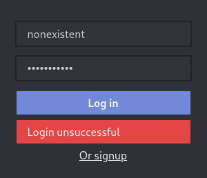
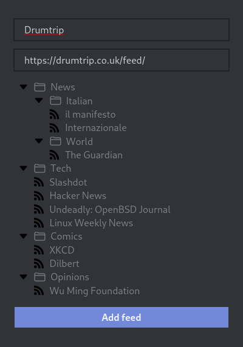

# rss-reader

- [Backend](backend/README.md)
- [Frontend](frontend/README.md)

## Screenshots

<table>
  <tr>
    <th>Login Form</th>
    <th>Signup Form</th>
  </tr>
  <tr>
    <th></th>
    <th></th>
  </tr> 

  <tr>
    <td>&nbsp;</td>
    <td>&nbsp;</td>
  </tr>

  <tr>
    <th>Login Failed</th>
    <th>Signup Failed</th>
  </tr>
  <tr>
    <th></th>
    <th></th>
  </tr>

  <tr>
    <td>&nbsp;</td>
    <td>&nbsp;</td>
  </tr>

  <tr>
    <th>Add Feed</th>
    <th>Add Folder</th>
  </tr>
  <tr>
    <th></th>
    <th></th>
  </tr>
</table>
